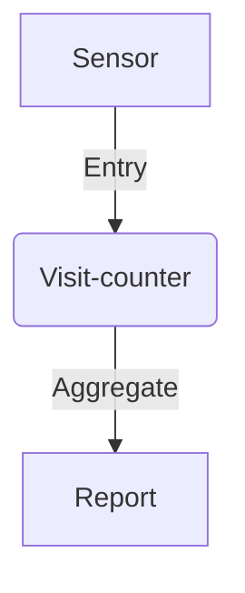

# Visit-counter Behavior

 

This project works out the features of a
visit-counting software, called the 'Visit-counter'.

 

Here's the context in which the Visit-counter works:

 

```mermaid
graph TD
A[Sensor] -->|Entry| B(Visit-counter)
B -->|Aggregate| C[Report]
```

 

